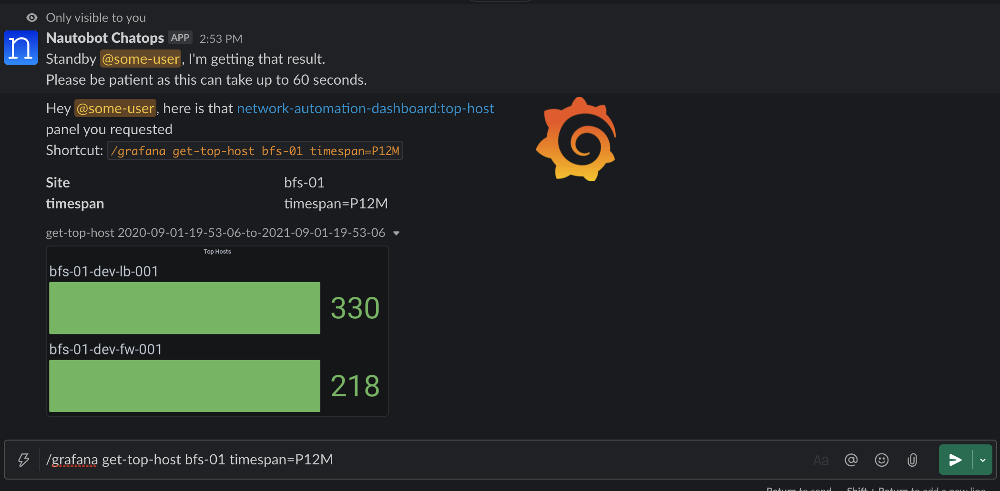
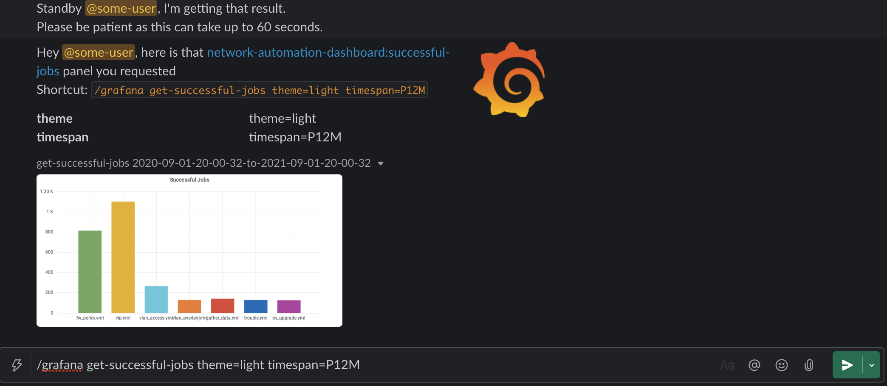
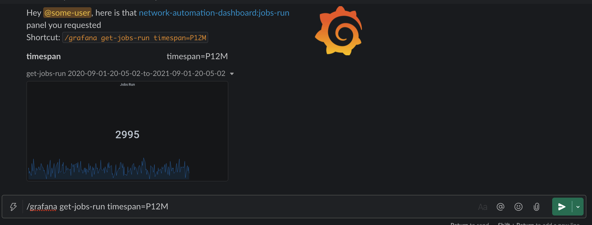
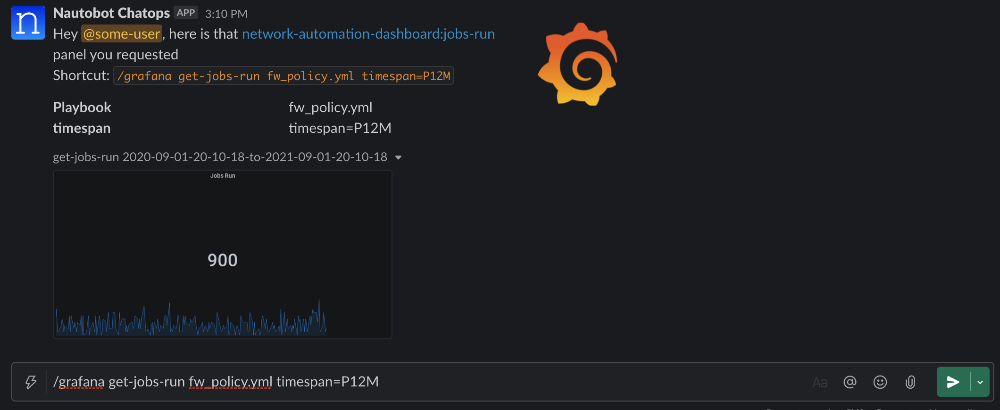
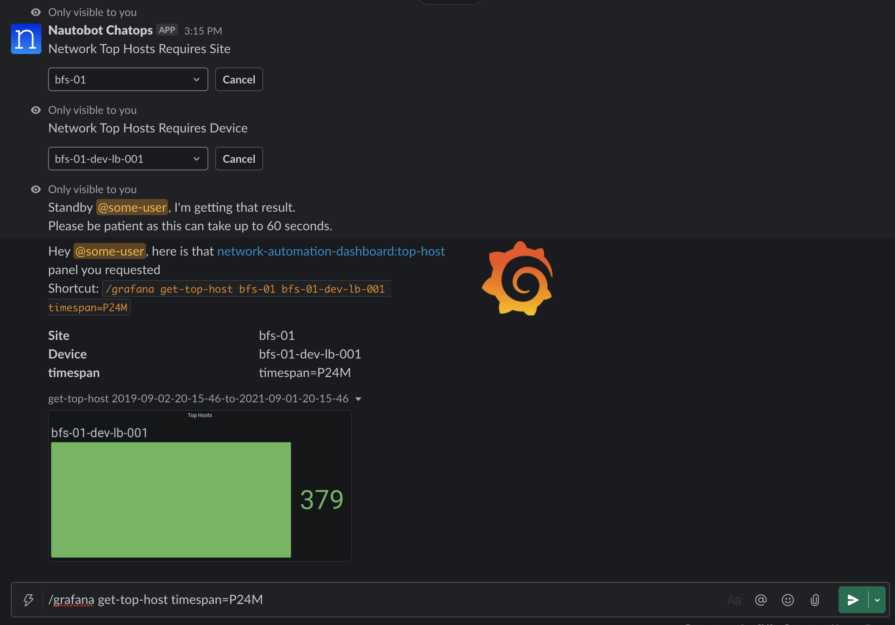

# The code in this repository has been migrated to the [Nautobot ChatOps Repository](https://github.com/nautobot/nautobot-plugin-chatops) as an integration - read more about it in the [ChatOps Docs](https://docs.nautobot.com/projects/chatops/en/latest/admin/install/)! As of July 2023 this repository has been **FROZEN** - all development / issues / discussions for this integration are in the [Nautobot ChatOps Repository](https://github.com/nautobot/nautobot-plugin-chatops) going forward.

# Grafana ChatOps 

The Grafana Chatops plugin is a [Nautobot](https://github.com/nautobot/nautobot) extension used with 
the [Nautobot ChatOps](https://github.com/nautobot/nautobot-plugin-chatops/)
base framework to provide all the operational graphs provided by Grafana delivered via chat clients.

## Documentation
 * [Installation Guide](docs/installation.md)
 * [Getting Started](docs/getting_started.md)
 * [Advanced Usage Guide](docs/advanced_usage.md)
 * [FAQ](docs/faq.md)
 * [Contributing](docs/contributing.md)
 * [Code of Conduct](docs/code_of_conduct.md)

## Usage

For basic usage and getting your first set of Grafana commands added to your chat client, see
the [Getting Started Guide](docs/getting_started.md).

To dive deeper into the Grafana configuration and variables within dashboards, see our 
[Advanced Usage Guide](docs/advanced_usage.md)

## Contributing

Thank you for your interest in helping to improve the Nautobot Grafana Plugin! 
Please refer to the [contributing](docs/contributing.md) guidelines for details.

### Project Documentation

Project documentation is generated by [mkdocs](https://www.mkdocs.org/) from the documentation located in the docs folder.  
You can configure [readthedocs.io](https://readthedocs.io/) to point at this folder in your repo.  
For development purposes a `docker-compose.docs.yml` is also included. 
 A container hosting the docs will be started using the invoke commands on [http://localhost:8001](http://localhost:8001), 
 as changes are saved the docs will be automatically reloaded.

## Questions

For any questions or comments, please check the [FAQ](docs/faq.md) first and feel free to swing by 
the [Network to Code slack channel](https://networktocode.slack.com/) (channel #networktocode).
Sign up [here](http://slack.networktocode.com/)

## Screenshots

* Get Top-Host *Bar Gauge* specifying the `last 12 months`:

* Get Successful Automation Jobs *Graph* specifying the `last 12 months` and `light` theme:

* Get Automation Jobs Run *Stat* chart specifying the `last 12 months`:

* Get Automation Jobs Run *Stat* chart specifying the `last 12 months` using a custom variable of `Playbook`:

* Get Top-Host *Bar Gauge* specifying the `last 12 months` with a `Device` and `Site` variable set, prompting in chat:

