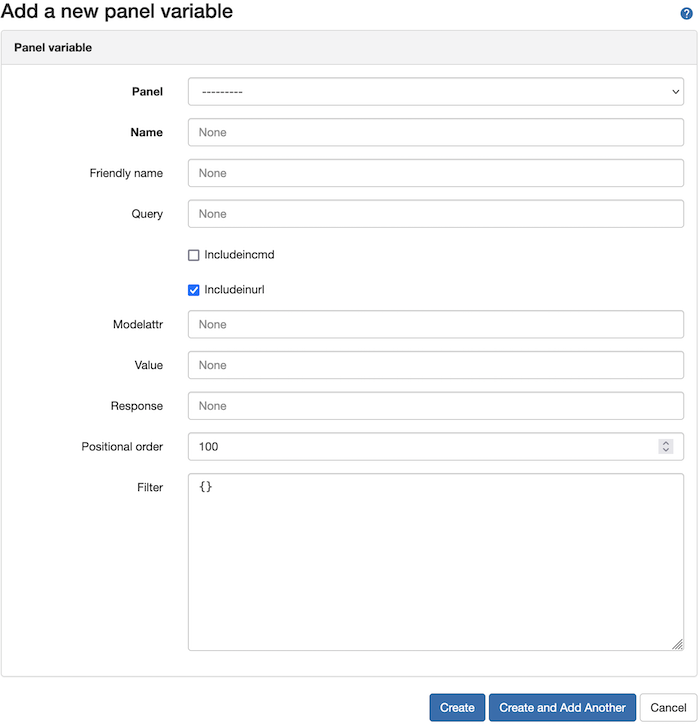

# Advanced Usage Guide
The purpose of this guide is to take the Grafana Chat configuration even further, by defining dashboard variables within
Nautobot and customizing them to provide additional filters and positional arguments to your chat commands.

## Defining Panel Variables
Just like the Grafana Dashboards and Panels, there are two ways to define a variable for a panel within Nautobot.
> **Panel variables can be used in conjunction with Nautobot DCIM models to help filter options prior to sending them
>to Grafana.**

### Defining a Panel Variable Manually
    
 To define a panel variable manually, you can do so by going to `Plugins > Variables` and clicking the `+ Add` button 
 located in the upper-right of the screen. 
 In the modal for a new dashboard, you need to define the `slug`, `uid`, and `Friendly Name`. 
 
 
 
 * `Name`
    * Name of the variable as it is defined in Grafana. This needs to match the Grafana variable name to align calls
 to Grafana for panels to pass the correct variable name in. 
 
 * `Friendly Name`
    * Only relative to Nautobot, friendly name allows you to provide a more descriptive name for your variable.
 
 * `Query`
    * The Nautobot model name to link this variable to. Examples are `Site`, `Region`, and `Device`. A full list of 
  Nautobot DCIM models can be seen [here](https://github.com/nautobot/nautobot/blob/develop/nautobot/dcim/models/__init__.py#L9).
  
 * `Modelattr`
    * The attribute that will be used to match variables passed in for a given model. For example, if you define a
 modelattr of `slug` with a `Query` of `Site`, then arguments passed in for this variable will filter in Nautobot based on the
 `Site.slug`.
 
 * `Value`
    * Similar to modelattr, but used to filter for a valid value to send to Grafana. Using jinja2 templating, 
 defines a template used to render the variable out of a Nautobot object. For instance, using the example
 variable set below, we would be able to render a template to extract the value we wanted out of the Nautobot object. 
 A variable of `{{ Site.slug }}` would extract the value `bfs-01`.  
```json
{
    "Site": {
        "id": "d9d3db86-b17c-4b8b-a561-11eca3a23cf9",
        "name": "bfs-01",
        "slug": "bfs-01",
        "region_id": "380ef3b5-eaa6-4b56-b279-2f1f8fd5b663"
    }
}
```

 * `Response`
    * When defined, this is the default argument sent to Grafana when another filter has not been defined for the variable.
 For instance, defining a "Response" of `All` when `All` is a valid variable to display all results in your Grafana variable is a common
 pattern for variable options. 
 
 * `Filter`
    * A key: value pair of filters to add into the query in addition to the one passed in via chat command positional arguments. 
 Using our `Site` example, if you wanted to filter even further and only present sites for region X, you could define a filter to do so,
 `{"region.name": "X"}`.
 
 * `Positional Order`
    * This numeric value gives the ability to order positional arguments in the chat command. If you have two variables of 
 `Site` and `Device` you could set a lower order to `Site` to ensure that it is the first positional argument in the command. 
 `/grafana get-top-host [Site] [Device]`


### Defining Panel Variables Using the Sync Method
 
Alternatively, you can define a sets of variables across all panels for your dashboard using the `Sync` method in the
Grafana plugin. To synchronize variables, navigate to `Plugins > Variables` and clicking the `Sync` button and selecting your dashboard.

This process will utilize the [DiffSync](https://diffsync.readthedocs.io/en/latest/) library to synchronize, create
, update, and delete dashboards in Nautobot with the Dashboards that are defined in the Grafana application. Once
complete, you will see all dashboards imported into Nautobot.

> **This will bring in basic variable data for each panel defined in a given dashboard. You will still need to edit 
> the variables with additional `modelattr`, `value`, `priority`, etc. as well as enable them in the cmd by setting the
> `includeincmd` checkbox to checked.**
    
    
## Questions

For any questions or comments, please check the [FAQ](faq.md) first and feel free to swing by 
the [Network to Code slack channel](https://networktocode.slack.com/) (channel #networktocode).
Sign up [here](http://slack.networktocode.com/)