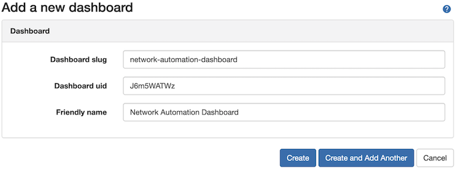
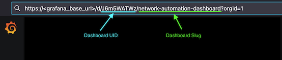
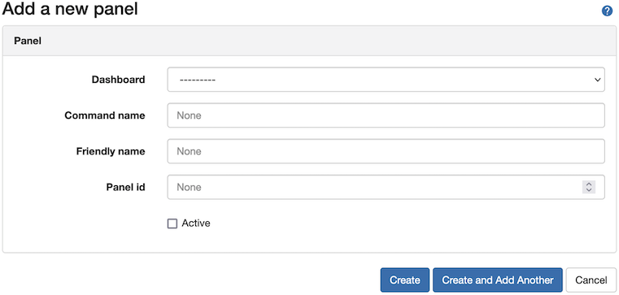
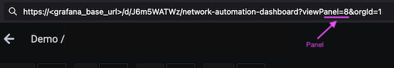

# Getting Started Guide
Before we start defining commands within our Grafana plugin, please make sure you have followed the 
[Installation Guide](installation.md) to ensure you have all the components setup and the Grafana application and
image rendering service is reachable from Nautobot.

Once these steps are complete, we can start defining commands within our Grafana Plugin!

## Defining Commands
To define a command within the Grafana Plugin for use with your chat client, there are two main components that 
we need to have populated. 
 1. Define at least one Grafana Dashboard.
 2. Define at least one Grafana Panel within the Dashboard. 
 
This tutorial will take you through the steps noted above to get a chat command exposed in your chat client. 

### Defining Grafana Dashboards
The first step is to define a dashboard so that the Grafana plugin is aware of the dashboard that exist 
within Grafana. You can define a dashboard in Grafana in two ways, defining a dashboard manually, 
or using the "Sync" feature to synchronize your Grafana dashboards automatically. 

#### Defining a Dashboard Manually
    
To define a dashboard manually, you can do so by going to `Plugins > Dashboards` and clicking the `+ Add` button 
located in the upper-right of the screen. In the modal for a new dashboard, you need to define the `slug`,
 `uid`, and `Friendly Name`. 

>
> NOTE: You can find the slug and uid info by navigating to your Grafana instance and going to the desired dashboard, 
 

#### Defining a Dashboard Using the Sync Method
 
Alternatively, you can define a set of dashboards by synchronizing your Grafana dashboard configuration to the
Grafana plugin. To synchronize dashboards, navigate to `Plugins > Dashboards` and clicking the `Sync` button.

This process will utilize the [DiffSync](https://diffsync.readthedocs.io/en/latest/) library to synchronize, create
, update, and delete dashboards in Nautobot with the Dashboards that are defined in the Grafana application. Once
complete, you will see all dashboards imported into Nautobot.
    
### Defining Grafana Panels
The second step to defining Grafana commands in Nautobot for your chat client is to define the panels you wish to expose
via chat. 
> Panels are closely associated to chat commands, where there will be a chat command for each panel defined. 

Similar to dashboards, you can define panels in two ways within Nautobot.

#### Defining a Panel Manually
  
To define a panel manually, you can do so by going to `Plugins > Panels` and clicking the `+ Add` button 
located in the upper-right of the screen. In the modal for a new panel, you need to select the dashboard that the
panel is defined under, then add a command name, along with a friendly name, and defined the `Panel ID`. 

The `Active` checkbox will allow the command to show up in your chat client. If the panel is marked as inactive, it
will still be defined in Nautobot, but restricted from being shown in the chat client.

> NOTE: You can find the panel id by navigating to your the desired panel, selecting `View`, then looking at the URL.
  
  
#### Defining Panels Using the Sync Method
  
Alternatively, you can define a set of panels by synchronizing your Grafana panels configuration for a given dashboard to the
Grafana plugin. To synchronize panels for a dashboard, navigate to `Plugins > Panels` and clicking the `Sync` button.

This process will utilize the [DiffSync](https://diffsync.readthedocs.io/en/latest/) library to synchronize, create
, update, and delete panels in Nautobot with the Dashboard Panels that are defined in the Grafana application. Once
complete, you will see all panels for a dashboard imported into Nautobot.

> **Panels are synchronized on a per-dashboard basis.**
  **All panels synchronized will be `INACTIVE` by default, you will need to set them to active to see in Chat.**

## Conclusion
Once dashboards and panels have been defined in Nautobot, you have the ability to mark any panels as active and you 
can now get all the insighs provided by Grafana graphs readily available in Chat!

See the [Advanced Usage](advanced_usage.md) documentation to go even further with Grafana chat commands by enabling 
Dashboard Variables to customize and filter your Grafana graphs!

## Questions

For any questions or comments, please check the [FAQ](faq.md) first and feel free to swing by 
the [Network to Code slack channel](https://networktocode.slack.com/) (channel #networktocode).
Sign up [here](http://slack.networktocode.com/)