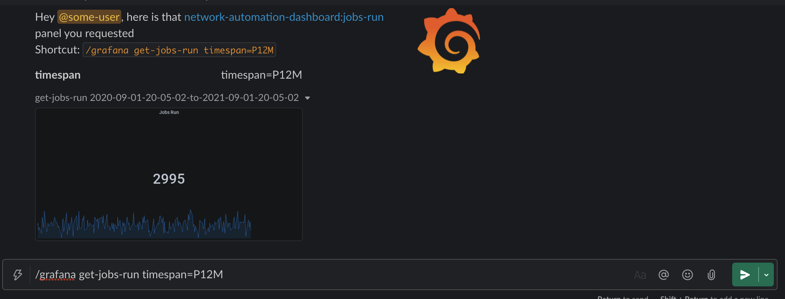
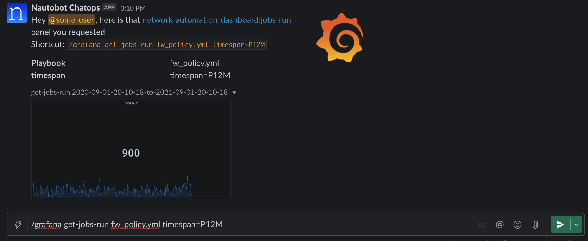

# Screenshots

* Get Top-Host *Bar Gauge* specifying the `last 12 months`:

* Get Successful Automation Jobs *Graph* specifying the `last 12 months` and `light` theme:

* Get Automation Jobs Run *Stat* chart specifying the `last 12 months`:

* Get Automation Jobs Run *Stat* chart specifying the `last 12 months` using a custom variable of `Playbook`:

* Get Top-Host *Bar Gauge* specifying the `last 12 months` with a `Device` and `Site` variable set, prompting in chat:

